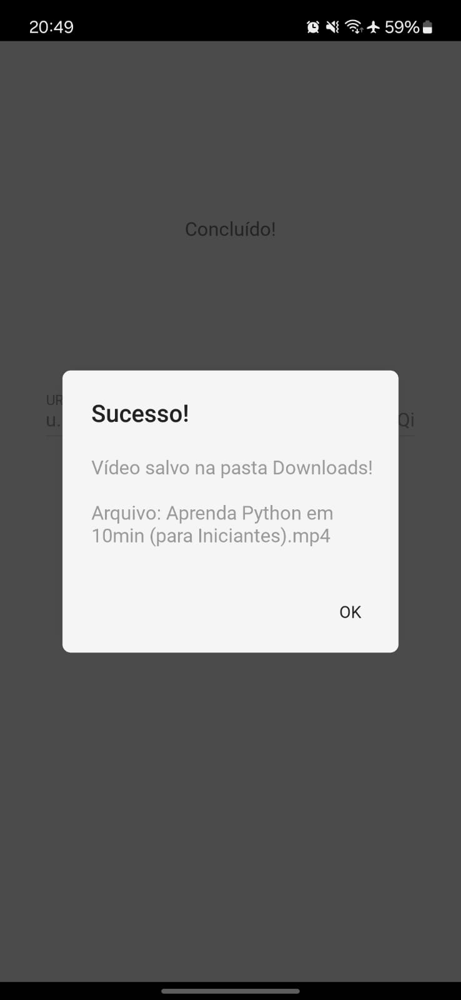

# 📱 Mobile YouTube Downloader (Python/Kivy)

> Um aplicativo Android nativo desenvolvido inteiramente em Python para download e processamento de mídia.

## 📖 Sobre o Projeto

Este projeto consiste em uma aplicação mobile capaz de baixar vídeos e áudios do YouTube diretamente para o armazenamento do dispositivo. O diferencial técnico é o uso de **Python em ambiente mobile**, utilizando o framework **Kivy** para a interface gráfica e o **Buildozer** para compilação e empacotamento do APK.

O objetivo foi resolver um problema real de produtividade (baixar mídia offline) enquanto explorava a interoperabilidade entre Python e as APIs nativas do Android (Java).

---

## 📸 Screenshots

| Tela Inicial | Download Concluído |
|:---:|:---:|
|  |  |

---

## 🚀 Funcionalidades

* **Download de Vídeo:** Baixa em formato MP4 com a melhor qualidade disponível.
* **Conversão de Áudio:** Extrai e converte áudio para MP3/M4A automaticamente.
* **Interface Material Design:** UI limpa e responsiva utilizando KivyMD.
* **Integração com Android:** Salva os arquivos diretamente na pasta pública de `Downloads` e notifica a galeria do sistema.

## 🛠️ Stack Tecnológica & Desafios Técnicos

* **Linguagem:** Python 3.11
* **Interface (GUI):** Kivy & KivyMD.
* **Core de Download:** `yt-dlp` (integrado via código, não apenas CLI).
* **Compilação:** Buildozer (para gerar o APK).

### Destaques de Implementação:

1.  **Threading & Concorrência:**
    * Para evitar o congelamento da interface (ANR - *Application Not Responding*) durante o download, todo o processamento pesado roda em **Threads** separadas, mantendo a UI fluida.
    
2.  **Interoperabilidade Python-Java (JNI):**
    * Uso da biblioteca `jnius` para acessar classes nativas do Android (`android.os.Environment`, `MediaScannerConnection`).
    * Isso permite manipular arquivos fora do *sandbox* do Python e forçar a atualização da galeria de mídia do celular.

3.  **Permissões em Tempo de Execução:**
    * Implementação de solicitação dinâmica de permissões (`WRITE_EXTERNAL_STORAGE`) conforme exigido pelas versões mais recentes do Android API.
